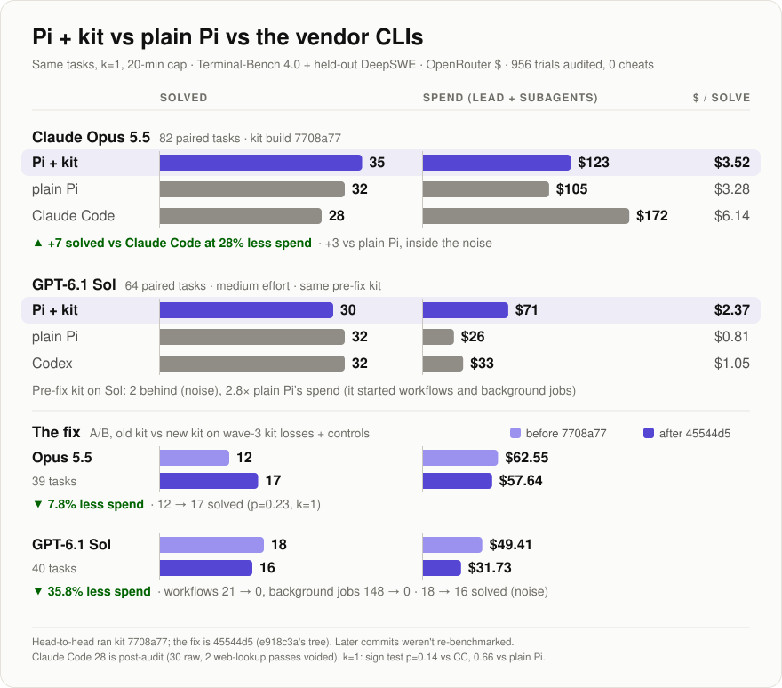

# deevs-pi-kit

I wanted Claude Code's background agents and workflows in [Pi](https://github.com/earendil-works/pi), on any model it runs, surviving a restart. I also wanted real Claude Code and Codex sessions as peers in [Herdr](https://herdr.dev) tabs, mailing my Pi back. This package does that, plus background jobs, monitors, missions and handoffs. I drive it with gpt-6.1-sol daily and bench it on Opus too, so it's tuned for both.

## What you get

| Tool | What it does |
|---|---|
| [`Agent`](docs/reference.md#agent) | Claude Code's agent tool, with agent types (`Explore`, `Plan`, reviewer, tester, ...), worktrees and 16 at once |
| [`Workflow`](docs/reference.md#workflow) | a JS script of `agent()`, `parallel()` and `pipeline()` you can edit and resume |
| [`job_start`](docs/reference.md#jobs-and-monitors) | a bounded background command that reports its exit code |
| [`Monitor`](docs/reference.md#jobs-and-monitors) | reports output lines, folder or URL changes, cron fires |
| [`mission_start`](docs/reference.md#missions) | one long goal the lead keeps at whenever it goes idle |
| [`collaborator_start`](docs/reference.md#collaborators) | Pi, Claude Code or Codex peers in Herdr tabs, writers in their own worktree |
| [`chain`](docs/reference.md#chains) | markdown handoffs in `.chains/`, with a save reminder at 80% context |

Tasks report back on their own and collaborator mail starts a turn. Monitors survive a restart too, a running job doesn't. `claude:` and `codex:` models run agents as real Claude Code or Codex workers.

A guard on every `bash`, job and monitor blocks detached processes, force pushes to `main` and recursive `rm` outside the project and temp dirs. Claude Code and Codex workers and collaborators get it as a hook.

Two commands: `/agents` lists tasks, collaborators, the mission and model names; `/chains` browses handoffs. Everything else you ask for in chat.

Also `wiki`, `arxiv`, `todo_list`, `ask_user`, fourteen skills, an optional `pi-kit.json` and a chains plugin for Claude Code and Codex, all in [docs/reference.md](docs/reference.md).

## Does it help?



On Opus the kit solves 7 more than Claude Code (5 before the audit voided 2 of CC's web-lookup passes; p=0.14 at k=1) for 28% less money. Vs plain Pi it's +3, which is noise.

On Sol the old kit lost by 2 and spent 2.8x what plain Pi did; it kept starting workflows and background jobs. I stopped that, and on a 40-task A/B Sol spend dropped 36%. No full Sol re-run yet, so no win claimed. The Terminal-Bench lane is in [bench/README.md](bench/README.md); the plain-Pi agent and DeepSWE runner aren't in this repo yet.

## Install

```bash
pi install git:github.com/DeevsDeevs/deevs-pi-kit    # add -l for this project only
pi update git:github.com/DeevsDeevs/deevs-pi-kit     # upgrade
```

Then `/reload`; before `pi update` read the [upgrade notes](docs/reference.md#upgrade-notes). Needs Pi 1.0.4+ and Node 22.19+ ([requirements](docs/reference.md#requirements)). The one real dependency, `@earendil-works/pi-durable` (about 90 packages, 125 MB), keeps agents alive across restarts.

## Quickstart

```text
> Have a reviewer agent check HEAD while you fix the failing test.
> Run a workflow: audit every route in src/api, then try to disprove each finding.
> Run the full test suite in the background and tell me when it finishes.
> Watch ./out and tell me when report.json appears.
> Start a Claude Code collaborator called reviewer on opus and ask it to review HEAD.
> Start a mission: move the CLI to the new config format; done when npm test passes.
```

Collaborators need Pi inside Herdr in a trusted project. Heads-up: a Claude Code one edits your `~/.claude.json` (accepts bypass permissions, copies folder trust to its worktree).

## Development

```bash
npm install
npm run check    # lint, typecheck, tests, polygon (needs Podman), audit, pack
```
