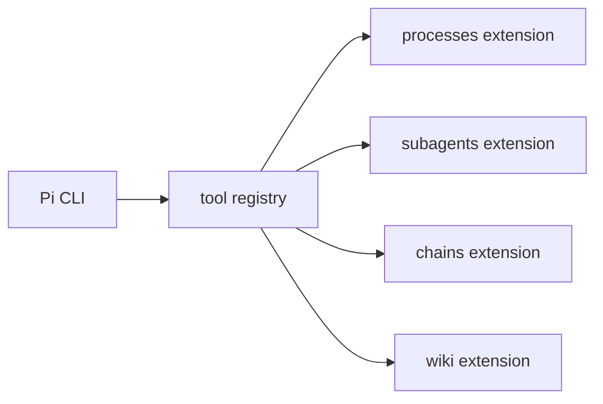
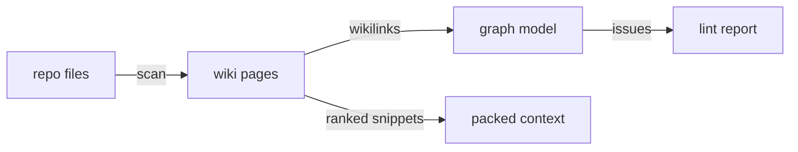
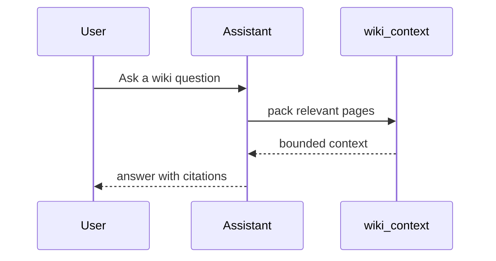
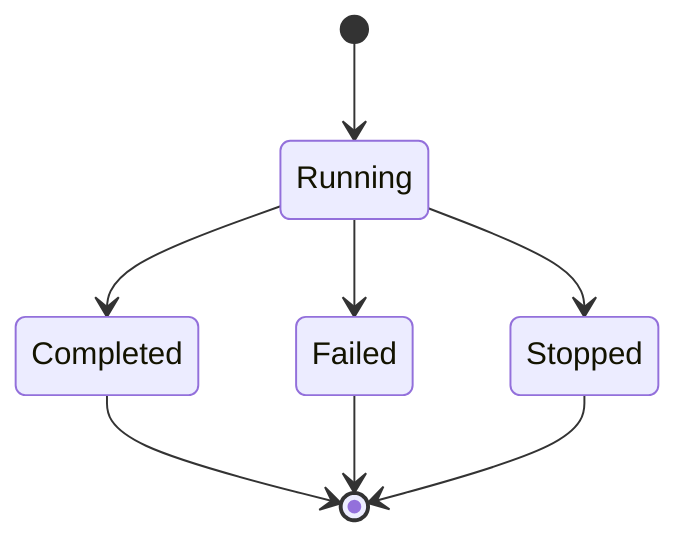
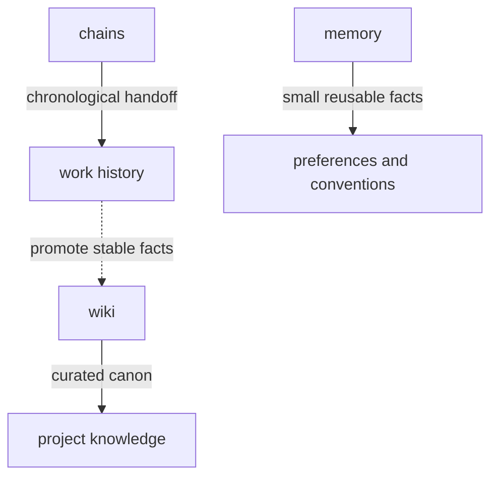
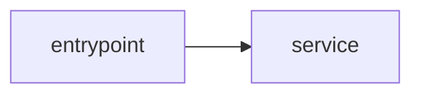

# Concept Diagrams

This is a Pi-native visual-reasoning skill, not a graphics generator. The goal is to make a system or idea easier to reason about with the smallest useful diagram.

Default to **Mermaid in Markdown**: it is reviewable in diffs, easy to edit, and works well in docs/wikis. Use **standalone SVG/HTML** only when the user asks for a polished visual file, printable diagram, or geometry Mermaid cannot express.

## Activation

Use when the user asks to:

- diagram, visualize, map, sketch, or explain something visually
- show architecture, module boundaries, dependencies, or data flow
- describe a protocol/request lifecycle as a sequence
- summarize states, lifecycles, transitions, or failure paths
- build a concept map or comparison view
- create docs/wiki diagrams from code or research notes

Do not use for:

- decorative graphics with no reasoning value
- production brand/UI design comps
- animation/video
- unknown systems that require research first
- one giant “everything diagram” for a large project

If the diagram is about a codebase, inspect relevant files before drawing. For broad codebases, ask or launch an `explorer` subagent to map structure, then draw from that map.

## The diagram brief

Before drawing, implicitly answer these five questions. Ask the user only if the answer is unclear and materially changes the diagram.

1. **Audience:** maintainer, new contributor, user, reviewer, or planner?
2. **Question:** what should the viewer understand after 20 seconds?
3. **View:** static structure, runtime flow, sequence, state, concept, or comparison?
4. **Evidence:** what files/docs/sources support the nodes and edges?
5. **Artifact:** inline answer, Markdown file, wiki page, or standalone HTML/SVG?

A good diagram has a thesis. Example: “Subagents are separate managed jobs; chains are parent-packed context; wiki is curated knowledge.”

## Output modes

### 1. Inline Mermaid, default

Use in normal answers when the user wants quick understanding.

### 2. Markdown diagram doc

Use when the user asks for durable docs or a wiki/doc page. Prefer project-local paths such as:

```text
docs/diagrams/<slug>.md
wiki/concepts/<slug>.md
```

### 3. Standalone HTML/SVG

Use when the user wants a polished artifact or browser-openable file. Use the local template:

```text
skills/concept-diagrams/templates/standalone-svg.html
```

### 4. Diagram pack

For complex systems, create 2-4 small diagrams instead of one dense chart:

- source layout
- runtime flow
- state/lifecycle
- data model or context boundaries

## Diagram grammar

Use shapes and edges consistently. Explain deviations in notes.

| Visual element | Meaning |
| --- | --- |
| Rectangle | component, page, file, tool, service |
| Rounded rectangle | user-facing action or command |
| Cylinder-like label | persistent storage or durable artifact |
| Diamond | branch/decision/failure mode |
| Subgraph | boundary: package, process, trust zone, lifecycle phase |
| Solid arrow | direct call, ownership, or required flow |
| Dashed arrow | optional, async, derived, or future/planned flow |
| Edge label | payload, command, event, or reason |

Mermaid has limited shape control, so prefer clear labels over fancy shapes.

## Recommended Mermaid views

### Source or architecture map

Use when showing ownership, modules, or packages.



### Runtime/data flow

Use when the key question is “what moves where?”



### Sequence

Use when order, actors, and replies matter.



### State/lifecycle

Use for statuses, background jobs, workflows, and failure handling.



### Concept relationship map

Use when edge labels are the substance.



### Comparison matrix

Sometimes a table beats a diagram. Use one when the core question is classification.

```markdown
| Thing | Best for | Not for |
| --- | --- | --- |
| Chains | session handoff | canonical docs |
| Wiki | curated knowledge | every-turn logs |
| Memory | stable preferences | source artifacts |
```

## Codebase diagram protocol

When diagramming code:

1. Read the obvious entrypoints first: `README`, package config, extension indexes, route files, or command registration files.
2. Trace only the relevant path. Do not map the whole repo unless asked.
3. Use file paths in node notes or a `Sources inspected` list.
4. Distinguish facts from inferred relationships.
5. Prefer “view packs” over a single monster diagram.

Useful source-grounded sections:

````markdown
## Diagram



## Notes

- Solid arrows are direct imports/calls observed in source.
- Dashed arrows are conceptual relationships.

## Sources inspected

- `extensions/wiki/index.ts`
- `extensions/wiki/service.ts`
````

If the user asks for a wiki diagram, store it in a wiki page only after checking `SCHEMA.md`, `index.md`, and existing pages.

## Readability budgets

Use these hard limits unless the user explicitly wants detail:

- 5-9 primary nodes per diagram
- 1-3 subgraphs
- 0-2 edge styles
- 0-1 cross-cutting legend
- node labels: 4-6 words max
- sequence diagrams: 3-5 participants max
- state diagrams: 5-8 states max

If a diagram exceeds the budget, split by view.

## Mermaid syntax guardrails

- Use stable ASCII IDs: `WikiContext`, not `wiki-context()`.
- Put human labels in brackets: `WikiContext[wiki_context tool]`.
- Quote labels only when necessary.
- Avoid punctuation-heavy IDs.
- Avoid raw `<`, `>`, `|`, `{`, `}` in labels unless escaped or quoted.
- Keep subgraph names short.
- Do not rely on theme-specific colors unless requested.

## Standalone HTML/SVG mode

Use for polished files only. Requirements:

- self-contained HTML; no CDN scripts or remote assets
- inline SVG only
- light/dark friendly CSS variables
- flat, minimal style
- readable at browser default zoom
- title, subtitle, diagram, and notes
- write to user path or `docs/diagrams/<slug>.html`

Do not start a preview server unless the user asks. If needed, use `proc_start`, bind to `127.0.0.1`, and stop it when done.

## Quality checks

Before final output:

- The diagram answers one clear question.
- Direction of reading is obvious.
- Each node and edge is backed by source, user input, or an explicit assumption.
- Edge labels add meaning rather than clutter.
- Boundaries/subgraphs mean something real.
- There is no unlabeled arrow between vague boxes.
- Large systems are split into multiple views.
- Codebase diagrams list inspected paths.
- Mermaid syntax is likely renderable.

## Anti-slop rules

Reject or revise diagrams that:

- restate prose as bubbles without adding structure
- show invented architecture from filenames only
- use arrows to mean five different things without a legend
- imply certainty where relationships are inferred
- cram everything into one unreadable view
- use decorative colors that imply false categories
- omit source/assumption notes for code or research claims
